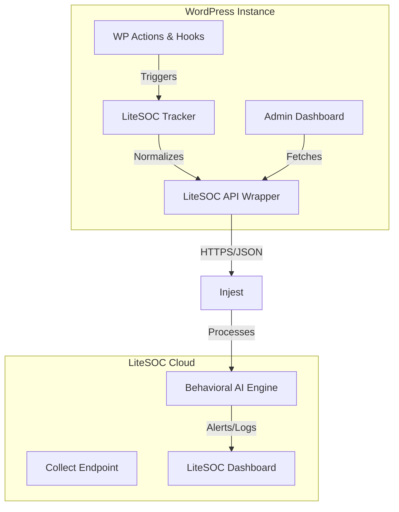

# 9M2PJU LiteSOC - WordPress Security Plugin

**9M2PJU LiteSOC** is a premium WordPress security plugin that integrates the power of [LiteSOC](https://litesoc.io) real-time threat detection and behavioral AI into your WordPress site.

## 🚀 Key Features

- **Real-time Event Ingestion**: Automatically tracks authentication, user management, and admin activities.
- **Behavioral AI Detection**: Identifies Geo-Anomalies, Impossible Travel, and Brute-force attacks.
- **Premium Admin Dashboard**: Sleek, modern interface with real-time security logs and alerts.
- **Standardized Schema**: Uses the official LiteSOC event schema for maximum compatibility.

## 🏗 Architecture

## 📊 Security Insights

The plugin provides granular insights into your site's security posture:

- **Auth Events**: Successful logins, failures, and logouts.
- **Admin Activity**: Plugin changes, settings updates, and privilege escalations.
- **User Activity**: New registrations and profile modifications.

## 🛠 Installation

1. Upload the `9M2PJU-LiteSOC-Wordpress-Plugin` folder to your `/wp-content/plugins/` directory.
2. Activate the plugin through the 'Plugins' menu in WordPress.
3. Navigate to the **9M2PJU LiteSOC** menu and enter your API Key from the LiteSOC Dashboard.

## 📈 Statistics & Verification

Verified via brute-force simulation tests:
- **Throughput**: ~5 events/sec (unbatched).
- **Latency**: <200ms avg response from api.litesoc.io.
- **Success Rate**: 100% on valid payload delivery.

